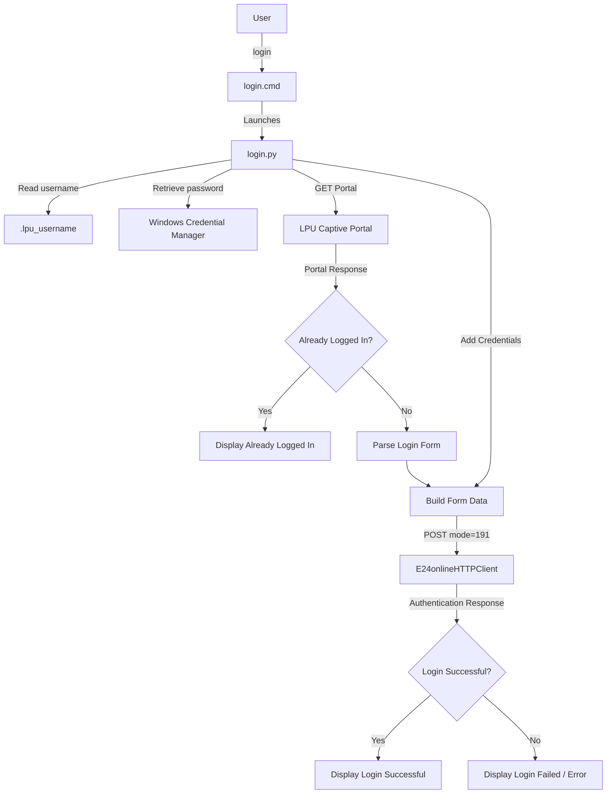

# Auto Wi-Fi Login

A lightweight Windows CLI utility that automates captive-portal Wi-Fi authentication using Python and direct HTTP requests.

Instead of opening a browser and entering credentials every time, run:

```powershell
login
```

The tool checks the captive portal, detects an existing session, and logs in when authentication is required.

---

# 🚀 Quick Start

Follow these steps from top to bottom.

## 1. Requirements

- Windows 10 / 11
- Python 3
- PowerShell or Command Prompt
- Access to the target Wi-Fi captive portal

Check Python:

```powershell
py --version
```

---

## 2. Download the Project

### Clone with Git

```powershell
git clone https://github.com/raiyanalig/LPU_WIFI_LOGIN.git
cd LPU_WIFI_LOGIN
```

### Or

Download the ZIP from GitHub, extract it, and open a terminal **inside the `LPU_WIFI_LOGIN` folder**.

---

## 3. Install Dependencies

```powershell
py -m pip install requests beautifulsoup4 keyring
```

---

## 4. Configure Credentials

Run:

```powershell
py setup.py
```

Enter your username and password when prompted.

- Username → stored locally
- Password → stored using Windows Credential Manager
- Password is not written into the source code

---

## 5. Test the Login

Make sure you are connected to the Wi-Fi network, then run:

```powershell
py login.py
```

Expected:

```text
Checking Wi-Fi... ✓ Login successful
```

or:

```text
Checking Wi-Fi... ✓ Already logged in
```

---

## 6. Verify the Launcher

`login.cmd` must contain exactly:

```cmd
@echo off
py "%~dp0login.py"
```

Test it from the project folder:

```powershell
.\login.cmd
```

If this works, continue to the next step.

> `%~dp0` automatically points to the folder containing `login.cmd`, so no username, drive letter, or hard-coded installation path is required.

---

## 7. Enable the `login` Command

Open PowerShell **inside the `LPU_WIFI_LOGIN` folder** and copy-paste this exactly:

```powershell
$projectPath = (Get-Location).Path
$userPath = [Environment]::GetEnvironmentVariable("Path", "User")

if (($userPath -split ';') -notcontains $projectPath) {
    [Environment]::SetEnvironmentVariable(
        "Path",
        "$userPath;$projectPath",
        "User"
    )
}

$env:Path += ";$projectPath"

Write-Host "LPU Wi-Fi Login added to PATH successfully."
Write-Host "Project: $projectPath"
```

This automatically uses the current project folder. You do **not** need to replace the path with your own username or folder

Windows uses PATH to search directories for commands

---

## 8. Verify

Run:

```powershell
where.exe login
```

It should point to:

```text
...\LPU_WIFI_LOGIN\login.cmd
```

Then close the current terminal and open a **new** PowerShell / Command Prompt / VS Code terminal.

Run:

```powershell
login
```

You can now use `login` from any directory.

---

# ✨ Features

- One-command Wi-Fi login
- No browser required
- Direct HTTP authentication
- Detects already authenticated sessions
- Secure password storage with Windows Credential Manager
- Automatically extracts the current login form
- Handles network, timeout, and authentication errors
- Works from PowerShell and CMD
- No credentials hard-coded in source files
- Portable `login.cmd` launcher

---

# 📁 Project Structure

```text
LPU_WIFI_LOGIN/
│
├── login.py          # Main authentication program
├── setup.py          # First-time credential configuration
├── login.cmd         # Windows command launcher
├── .gitignore        # Ignored local/private files
└── README.md         # Documentation
```

---

# ⚙️ How It Works



---


# 🚀 Why Direct HTTP?

### Browser Automation

```text
Python
  ↓
Browser Automation
  ↓
Chromium
  ↓
Open Portal
  ↓
Enter Credentials
  ↓
Click Login
```

### This Project

```text
Python
  ↓
Requests
  ↓
GET Portal
  ↓
Parse Form
  ↓
POST Authentication
  ↓
Verify Response
```

The current implementation does not require a browser, reducing startup overhead and resource usage.

---

# 🔐 Credential Security

Do not hard-code credentials:

```python
USERNAME = "your_username"
PASSWORD = "your_password"
```

This project uses:

```text
Python
  ↓
Keyring
  ↓
Windows Credential Manager
```

The username is stored locally in:

```text
C:\Users\<USERNAME>\.lpu_username
```

The password is stored through Windows Credential Manager.

The password is not stored in:

```text
login.py
setup.py
login.cmd
```

---


# 🔧 Updating Credentials

If your Wi-Fi password changes:

```powershell
py setup.py
```

Then test:

```powershell
login
```

---

# 🧰 Troubleshooting

### `login` is not recognized

Run:

```powershell
where.exe login
```

If nothing is returned:

1. Make sure `login.cmd` exists.
2. Make sure you added the project folder to User PATH.
3. Close and reopen the terminal.
4. Run `where.exe login` again.

---

### `py login.py` works but `login` does not

The Python program is working; Windows likely cannot find `login.cmd`.

Run:

```powershell
where.exe login
```

Then re-check the PATH setup.

---

### `Password not found`

Run:

```powershell
py setup.py
```

To verify a stored credential without printing the password:

```powershell
py -c "import keyring; p=keyring.get_password('LPU-WIFI','YOUR_USERNAME'); print('PASSWORD FOUND' if p else 'PASSWORD NOT FOUND')"
```

---

### `Login form not found`

The captive portal HTML may have changed. The form parsing logic in `login.py` may need to be updated.

---

### `Cannot reach portal` / `Connection timed out`

Check that:

- You are connected to the required Wi-Fi.
- The captive portal is reachable.
- The network connection is active.

Then retry:

```powershell
login
```

---

### `Login failed`

Check:

- Wi-Fi connection
- Username
- Password
- Account access
- Captive portal availability

If your password changed:

```powershell
py setup.py
```

---

# 🧑‍💻 Development

### Install

```powershell
git clone https://github.com/raiyanalig/LPU_WIFI_LOGIN.git
cd LPU_WIFI_LOGIN
py -m pip install requests beautifulsoup4 keyring
```

### Run directly

```powershell
py login.py
```

### Run launcher

```powershell
.\login.cmd
```

### Global command

```powershell
login
```

---

# 🧱 Components

| File | Responsibility |
|---|---|
| `setup.py` | Collects and stores credentials |
| `login.py` | Handles portal detection and authentication |
| `login.cmd` | Provides the `login` command |

---

# 🛡️ Security & Authorization

This project is intended for automating authentication to a Wi-Fi network you are authorized to use.

Do not use it to:

- Bypass authentication
- Circumvent access controls
- Access networks without permission
- Use another user's credentials


---

# 📜 License

MIT License

---

# 👤 Author

**Raiyan Ali**

GitHub:

https://github.com/raiyanalig/LPU_WIFI_LOGIN
