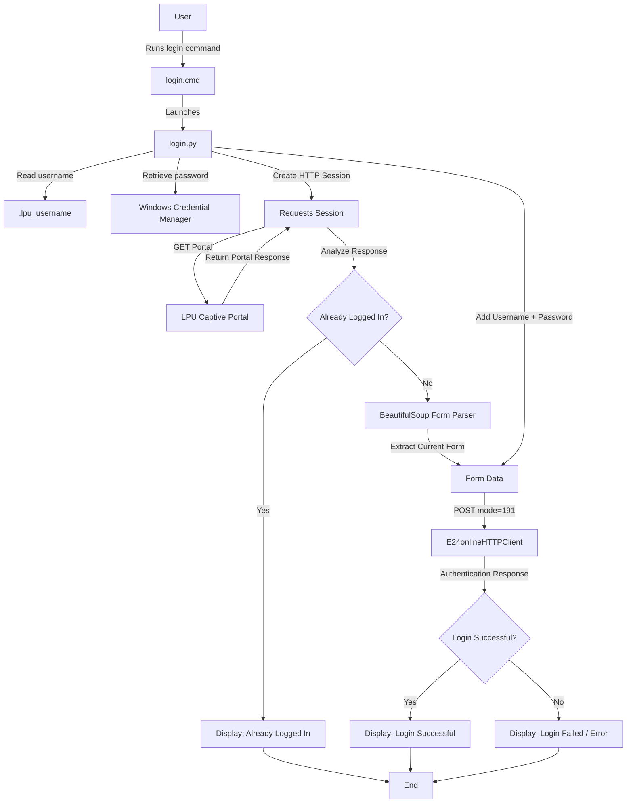

# Auto Wi-Fi Login

A lightweight Windows CLI utility that automates captive-portal Wi-Fi authentication using Python and direct HTTP requests.

Instead of opening a browser and manually entering your credentials every time, simply run:

```powershell
login
```

The application checks the captive portal, detects whether you are already authenticated, and automatically performs the login when authentication is required.

---

## Features

- One-command Wi-Fi login
- No browser required
- Fast direct HTTP authentication
- Detects already authenticated sessions
- Secure password storage using Windows Credential Manager
- Automatically extracts the current login form
- Handles network, timeout, and authentication errors
- Works from Windows PowerShell and CMD
- No credentials stored directly in the source code

---

## Tech Stack

| Technology                 | Purpose                                    |
| -------------------------- | ------------------------------------------ |
| Python 3                   | Main application                           |
| Requests                   | HTTP communication with the captive portal |
| BeautifulSoup4             | HTML and form parsing                      |
| Keyring                    | Secure credential access                   |
| Windows Credential Manager | Password storage                           |
| Windows Batch (`.cmd`)   | Creates the`login` command               |

---

## Project Structure

```text
auto-wifi-login/
│
├── login.py          # Main authentication program
├── setup.py          # First-time credential configuration
├── login.cmd         # Windows command launcher
├── .gitignore        # Git ignored files
└── README.md         # Project documentation
```

---

# Requirements

Before using the project, make sure you have:

- Windows 10 or Windows 11
- Python 3 installed
- Access to the Wi-Fi network using the captive portal
- PowerShell or Command Prompt

---

# Installation

## 1. Clone the Repository

```powershell
git clone https://github.com/YOUR-USERNAME/YOUR-REPOSITORY.git
```

Move into the project directory:

```powershell
cd YOUR-REPOSITORY
```

Alternatively, download the repository as a ZIP file from GitHub and extract it.

---

## 2. Verify Python

Run:

```powershell
py --version
```

Example:

```text
Python 3.14.0
```

If Python is not installed, install Python for Windows first.

---

## 3. Install Dependencies

Run:

```powershell
py -m pip install requests beautifulsoup4 keyring
```

The required packages are:

```text
requests
beautifulsoup4
keyring
```

---

# First-Time Setup

Before using the `login` command, configure your Wi-Fi credentials.

Run:

```powershell
py setup.py
```

You will be prompted for your credentials:

```text
Enter your LPU username:
Enter your LPU password:
```

The setup program:

1. Reads your username
2. Reads your password securely
3. Stores the username locally
4. Stores the password using Windows Credential Manager

Your password is never written into `login.py`.

---

# Run the Login

Make sure you are connected to the Wi-Fi network that uses the captive portal.

Run:

```powershell
py login.py
```

Example:

```text
Checking Wi-Fi... ✓ Login successful
```

If you are already authenticated:

```text
Checking Wi-Fi... ✓ Already logged in
```

---

# Use `login` as a Global Command

The repository contains:

```text
login.cmd
```

which launches:

```text
login.py
```

To use:

```powershell
login
```

from any directory, add the project directory to your Windows `PATH`.

For example:

```powershell
$bin = "$HOME\lpu-login"
$userPath = [Environment]::GetEnvironmentVariable("Path", "User")

if (($userPath -split ';') -notcontains $bin) {
    [Environment]::SetEnvironmentVariable(
        "Path",
        "$userPath;$bin",
        "User"
    )
}

$env:Path += ";$bin"
```

Close PowerShell and open a new PowerShell window.

Now you can simply run:

```powershell
login
```

from anywhere.

Example:

```text
PS C:\Users\Username> login

Checking Wi-Fi... ✓ Login successful
```

---

## How It Works




# Authentication Flow

The application follows this process:

```text
1. Read saved username
             ↓
2. Retrieve password from Windows Credential Manager
             ↓
3. Create an HTTP session
             ↓
4. Request the captive portal
             ↓
5. Check whether the session is already authenticated
             ↓
6. If authentication is required:
             ↓
7. Extract the current login form
             ↓
8. Add username/password and required parameters
             ↓
9. Submit HTTP POST request
             ↓
10. Verify the server response
             ↓
11. Display login status
```

---

# Authentication Endpoint

The captive portal uses the following endpoint for authentication:

```text
https://internet.lpu.in/24online/servlet/E24onlineHTTPClient
```

The login operation uses an HTTP `POST` request.

The portal uses:

```text
mode=191
```

as part of the login request.

---

# Why Direct HTTP Instead of Browser Automation?

The original approach used browser automation.

### Browser-based approach

```text
Python
   ↓
Playwright
   ↓
Chromium
   ↓
Open Portal
   ↓
Find Username Field
   ↓
Enter Username
   ↓
Find Password Field
   ↓
Enter Password
   ↓
Click Login
```

This requires starting a browser and rendering the webpage.

### Current approach

```text
Python
   ↓
Requests
   ↓
GET Portal
   ↓
Extract Form
   ↓
POST Authentication
   ↓
Verify Response
```

The current implementation does not require a browser.

This reduces startup overhead and makes the command faster and lighter.

---

# Credential Security

Credentials should never be hard-coded into the source code.

Avoid:

```python
USERNAME = "12345678"
PASSWORD = "mypassword"
```

Instead, this project uses:

```text
Python
   ↓
Keyring
   ↓
Windows Credential Manager
```

The password is retrieved only when the application needs to authenticate.

---

# Local Credential Storage

The username is stored locally in:

```text
C:\Users\<USERNAME>\.lpu_username
```

The password is stored by:

```text
Windows Credential Manager
```

The password is not stored in:

```text
login.py
setup.py
login.cmd
```

---

# `.gitignore`

Do not commit credentials or generated Python files to GitHub.

Recommended `.gitignore`:

```gitignore
.lpu_username
__pycache__/
*.pyc
.env
.vscode/
.idea/
```

Never commit:

- Passwords
- Authentication tokens
- Session cookies
- API keys
- Private credentials

---

# Updating Your Password

If your Wi-Fi password changes, run:

```powershell
py setup.py
```

Enter the updated credentials.

Then test:

```powershell
login
```

---

# Troubleshooting

## `login` is not recognized

Check whether Windows can find the command:

```powershell
where.exe login
```

If nothing is returned, make sure the directory containing `login.cmd` is present in your user `PATH`.

---

## `Password not found`

Run:

```powershell
py setup.py
```

and configure your credentials again.

You can also verify the keyring entry without displaying the password:

```powershell
py -c "import keyring; p=keyring.get_password('LPU-WIFI','YOUR_USERNAME'); print('PASSWORD FOUND' if p else 'PASSWORD NOT FOUND')"
```

---

## `Login form not found`

The captive portal HTML may have changed.

The application depends on the portal's form structure. If the portal changes its HTML, the form selector in `login.py` may need to be updated.

---

## `Cannot reach LPU portal`

Make sure you are connected to the Wi-Fi network that provides the captive portal.

Check your Wi-Fi connection before running:

```powershell
login
```

---

## `Connection timed out`

The captive portal may be temporarily unavailable or the Wi-Fi network may not have completed its connection.

Try:

```powershell
login
```

again after confirming your Wi-Fi connection.

---

## `Login failed`

Check:

- Wi-Fi connection
- Username
- Password
- Account access
- Captive portal availability

If you recently changed your password, run:

```powershell
py setup.py
```

again.

---

# Quick Start

For a new installation:

```powershell
git clone https://github.com/raiyanalig/LPU_WIFI_LOGIN.git

cd YOUR-REPOSITORY

py -m pip install requests beautifulsoup4 keyring

py setup.py

py login.py
```

After configuring the `login` command:

```powershell
login
```

---

# Example

### Successful Login

```text
PS C:\Users\Username> login

Checking Wi-Fi... ✓ Login successful
```

### Already Logged In

```text
PS C:\Users\Username> login

Checking Wi-Fi... ✓ Already logged in
```

### Login Failure

```text
PS C:\Users\Username> login

Checking Wi-Fi... ✗ Login failed
  Check your username/password.
```

### Wi-Fi Unavailable

```text
PS C:\Users\Username> login

Checking Wi-Fi... ✗ Cannot reach Wi-Fi portal
  Connect to the required Wi-Fi network first.
```

---

# Development

The application is divided into three main components.

## `setup.py`

Responsible for:

- Collecting credentials
- Normalizing the username
- Saving the username
- Storing the password securely

---

## `login.py`

Responsible for:

- Reading credentials
- Creating the HTTP session
- Accessing the captive portal
- Detecting existing sessions
- Extracting the login form
- Sending the authentication request
- Verifying the response
- Handling errors

---

## `login.cmd`

Responsible for providing the simple Windows command:

```text
login
```

It launches the Python authentication program.

---

# Architecture

```text
┌─────────────────────┐
│       User          │
│                     │
│       login         │
└──────────┬──────────┘
           │
           ▼
┌─────────────────────┐
│     login.cmd       │
│  Windows Launcher   │
└──────────┬──────────┘
           │
           ▼
┌─────────────────────┐
│      login.py       │
│   Python Application │
└───────┬───────┬─────┘
        │       │
        │       ▼
        │  ┌──────────────┐
        │  │   Requests   │
        │  └──────┬───────┘
        │         │
        │         ▼
        │  ┌──────────────┐
        │  │ Wi-Fi Portal │
        │  └──────────────┘
        │
        ▼
┌─────────────────────┐
│       Keyring       │
└──────────┬──────────┘
           │
           ▼
┌──────────────────────────┐
│ Windows Credential       │
│ Manager                  │
└──────────────────────────┘
```

---

# Security and Authorization

This project is intended for automating authentication to a Wi-Fi network that you are authorized to use.

Do not use this software to:

- Bypass authentication
- Circumvent access controls
- Access networks without permission
- Use another user's credentials
- Store or distribute credentials publicly

---

# License

MIT License

---

# Author

**Raiyan Ali**

GitHub:

```text
https://github.com/raiyanalig/LPU_WIFI_LOGIN.git
```

---

## Project Status

**Status:** Working

The application currently supports:

- Direct HTTP authentication
- Credential management
- Session detection
- CLI execution
- Windows PowerShell/CMD support
- Browserless authentication
