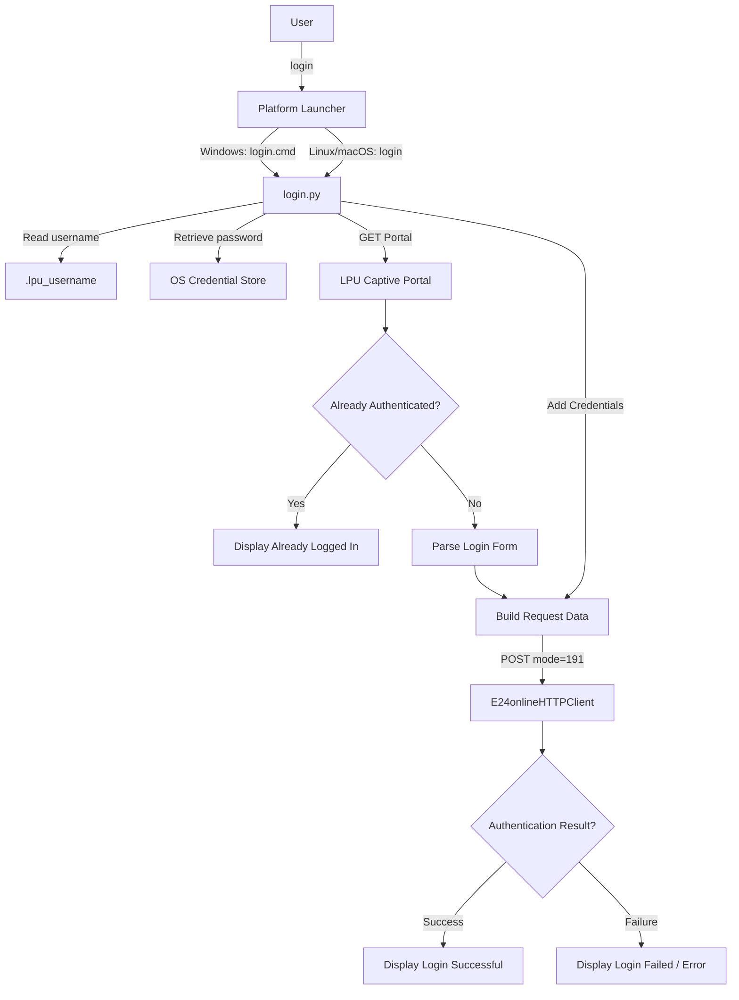

# Auto Wi-Fi Login

A lightweight cross-platform CLI utility for automating captive-portal Wi-Fi authentication using Python and direct HTTP requests.

Instead of opening a browser and entering credentials manually, configure the tool once and run:

```bash
login
```

The application checks the captive portal, detects whether the device is already authenticated, and performs authentication when required.

---

# 🚀 Quick Start

> **Choose your operating system and follow only that section.**
>
> After the one-time setup, the command is simply:
>
> ```text
> login
> ```

| Platform | Launcher | Setup |
|---|---|---|
| 🪟 Windows | [`login.cmd`](./login.cmd) | [Windows](#-windows) |
| 🐧 Linux | [`login`](./login) | [Linux](#-linux) |
| 🍎 macOS | [`login`](./login) | [macOS](#-macos) |

# 🪟 Windows

## 1. Requirements

- Windows 10 or Windows 11
- Python 3
- PowerShell or Command Prompt
- Access to the required Wi-Fi captive portal

Check Python:

```powershell
py --version
```

## 2. Download

Using Git:

```powershell
git clone https://github.com/raiyanalig/LPU_WIFI_LOGIN.git
cd LPU_WIFI_LOGIN
```

Or download the ZIP from GitHub, extract it, and open PowerShell/CMD **inside the `LPU_WIFI_LOGIN` folder**.

## 3. Install dependencies

```powershell
py -m pip install -r requirements.txt
```

## 4. Configure credentials

```powershell
py setup.py
```

Enter your credentials when prompted.

- Username → stored locally
- Password → stored through the operating system credential store
- Password → not written into the source code

## 5. Test authentication

Connect to the required Wi-Fi and run:

```powershell
py login.py
```

Expected:

```text
Checking Wi-Fi... ✓ Login successful
```

or:

```text
Checking Wi-Fi... ✓ Already logged in
```

## 6. Verify `login.cmd`

`login.cmd` must contain exactly:

```cmd
@echo off
py "%~dp0login.py"
```

Test it:

```powershell
.\login.cmd
```

`%~dp0` automatically refers to the directory containing `login.cmd`, so the launcher does not depend on a specific Windows username, drive, or installation path.

## 7. Enable the global `login` command

Open PowerShell **inside the project folder** and run:

```powershell
$projectPath = (Get-Location).Path
$userPath = [Environment]::GetEnvironmentVariable("Path", "User")

if (($userPath -split ';') -notcontains $projectPath) {
    [Environment]::SetEnvironmentVariable(
        "Path",
        "$userPath;$projectPath",
        "User"
    )
}

$env:Path += ";$projectPath"

Write-Host "✓ LPU Wi-Fi Login added to PATH."
Write-Host "  Project: $projectPath"
```

**Important:** Add the **project folder** to PATH, not `login.cmd` itself.

## 8. Verify

```powershell
where.exe login
```

Expected:

```text
<your-project-folder>\LPU_WIFI_LOGIN\login.cmd
```

Close the current terminal and open a new PowerShell/CMD window.

## 9. Use from anywhere

```powershell
login
```

---

# 🐧 Linux

## 1. Requirements

- Linux
- Python 3
- Bash or another POSIX-compatible shell
- Access to the required Wi-Fi captive portal

Check Python:

```bash
python3 --version
```

## 2. Download

```bash
git clone https://github.com/raiyanalig/LPU_WIFI_LOGIN.git
cd LPU_WIFI_LOGIN
```

Or download and extract the ZIP, then open a terminal inside the project folder.

## 3. Install dependencies

```bash
python3 -m pip install -r requirements.txt
```

## 4. Configure credentials

```bash
python3 setup.py
```

## 5. Make the launcher executable

```bash
chmod +x login
```

## 6. Test

```bash
./login
```

Expected:

```text
Checking Wi-Fi... ✓ Login successful
```

or:

```text
Checking Wi-Fi... ✓ Already logged in
```

## 7. Enable the global `login` command

From the project directory:

```bash
mkdir -p ~/.local/bin
ln -sf "$(pwd)/login" ~/.local/bin/login
```

For Bash:

```bash
echo 'export PATH="$HOME/.local/bin:$PATH"' >> ~/.bashrc
source ~/.bashrc
```

For Zsh:

```bash
echo 'export PATH="$HOME/.local/bin:$PATH"' >> ~/.zshrc
source ~/.zshrc
```

Verify:

```bash
which login
```

Then:

```bash
login
```

---

# 🍎 macOS

## 1. Requirements

- macOS
- Python 3
- Terminal
- Access to the required Wi-Fi captive portal

Check Python:

```bash
python3 --version
```

## 2. Download

```bash
git clone https://github.com/raiyanalig/LPU_WIFI_LOGIN.git
cd LPU_WIFI_LOGIN
```

Or download and extract the ZIP, then open Terminal inside the project folder.

## 3. Install dependencies

```bash
python3 -m pip install -r requirements.txt
```

## 4. Configure credentials

```bash
python3 setup.py
```

## 5. Make the launcher executable

```bash
chmod +x login
```

## 6. Test

```bash
./login
```

Expected:

```text
Checking Wi-Fi... ✓ Login successful
```

or:

```text
Checking Wi-Fi... ✓ Already logged in
```

## 7. Enable the global `login` command

macOS normally uses Zsh:

```bash
mkdir -p ~/.local/bin
ln -sf "$(pwd)/login" ~/.local/bin/login
echo 'export PATH="$HOME/.local/bin:$PATH"' >> ~/.zshrc
source ~/.zshrc
```

Verify:

```bash
which login
```

Then:

```bash
login
```

---

# 📁 Project Structure

```text
LPU_WIFI_LOGIN/
│
├── login.py            # Shared authentication logic
├── setup.py            # Credential configuration
├── login.cmd           # Windows launcher
├── login               # Linux/macOS launcher
├── requirements.txt    # Python dependencies
├── .gitignore
└── README.md
```

### Platform-specific files

| File | Platform | Purpose |
|---|---|---|
| `login.cmd` | 🪟 Windows | Launches `login.py` using the Windows Python launcher |
| `login` | 🐧 Linux / 🍎 macOS | POSIX shell launcher for `login.py` |

The authentication logic remains shared in `login.py`.

---

# ⚙️ How It Works



---


# 🚀 Why Direct HTTP?

### Browser automation

```text
Python
  ↓
Browser Automation
  ↓
Browser
  ↓
Open Portal
  ↓
Enter Credentials
  ↓
Submit Login
```

### Current implementation

```text
Python
  ↓
Requests
  ↓
GET Portal
  ↓
Parse Form
  ↓
POST Authentication
  ↓
Verify Response
```

The current implementation does not require a browser.

---

# 🔐 Credential Security

Never hard-code credentials:

```python
USERNAME = "your_username"
PASSWORD = "your_password"
```

The application uses `keyring` to access the operating system's credential storage.

```text
login.py
   ↓
keyring
   ↓
OS Credential Store
```

The username is stored locally. The password is not stored in:

```text
login.py
setup.py
login.cmd
login
```

Do not commit passwords, API keys, authentication tokens, cookies, or other private credentials to GitHub.

---

# 📦 Dependencies

`requirements.txt`:

```text
requests
beautifulsoup4
keyring
```

Install with:

### Windows

```powershell
py -m pip install -r requirements.txt
```

### Linux / macOS

```bash
python3 -m pip install -r requirements.txt
```

> Linux credential-store availability can vary by desktop environment. If `keyring` cannot access a suitable backend, additional system keyring configuration may be required.

---

# 🔧 Updating Credentials

If your Wi-Fi password changes, run the setup script again.

### Windows

```powershell
py setup.py
```

### Linux / macOS

```bash
python3 setup.py
```

Then run:

```text
login
```

---

# 🧰 Troubleshooting

## `login` is not recognized

### Windows

```powershell
where.exe login
```

If no result is returned, verify that the folder containing `login.cmd` is in User PATH.

### Linux / macOS

```bash
which login
```

If no result is returned, verify that `~/.local/bin` is in PATH and that the `login` launcher is executable.

## `py login.py` works but `login` does not

The Python authentication code is working, but the platform launcher is not being resolved.

### Windows

```powershell
where.exe login
```

### Linux / macOS

```bash
which login
```

## `Password not found`

Run the credential setup again.

### Windows

```powershell
py setup.py
```

### Linux / macOS

```bash
python3 setup.py
```

To verify a stored credential without displaying the password:

```bash
python3 -c "import keyring; p=keyring.get_password('LPU-WIFI','YOUR_USERNAME'); print('PASSWORD FOUND' if p else 'PASSWORD NOT FOUND')"
```

On Windows, use `py` instead of `python3`.

## `Login form not found`

The captive portal HTML may have changed. The form-parsing logic in `login.py` may need to be updated.

## `Cannot reach portal` / `Connection timed out`

Check that:

- You are connected to the required Wi-Fi.
- The captive portal is reachable.
- The network connection is active.

Then retry:

```text
login
```

## `Login failed`

Check the Wi-Fi connection, username, password, account access, and captive-portal availability.

---

# 🧑‍💻 Development

Clone the repository:

```bash
git clone https://github.com/raiyanalig/LPU_WIFI_LOGIN.git
cd LPU_WIFI_LOGIN
```

Install dependencies:

### Windows

```powershell
py -m pip install -r requirements.txt
```

### Linux / macOS

```bash
python3 -m pip install -r requirements.txt
```

Run the shared Python application directly:

### Windows

```powershell
py login.py
```

### Linux / macOS

```bash
python3 login.py
```

Run the platform launcher:

### Windows

```powershell
.\login.cmd
```

### Linux / macOS

```bash
./login
```

---

# 🧱 Components

| Component | Responsibility |
|---|---|
| `setup.py` | Collects and stores credentials |
| `login.py` | Portal detection and HTTP authentication |
| `login.cmd` | Windows command launcher |
| `login` | Linux/macOS command launcher |
| `requirements.txt` | Python dependencies |

---

# 🛡️ Security & Authorization

This project is intended for automating authentication to a Wi-Fi network you are authorized to use.

Do not use it to:

- Bypass authentication
- Circumvent access controls
- Access networks without permission
- Use another user's credentials


---

# 📌 Project Status

**Status:** 

Current functionality:

- Direct HTTP authentication
- Captive-portal session detection
- Credential management
- Browserless login
- Windows CLI launcher
- Linux/macOS CLI launcher structure
- PowerShell, Bash, and Zsh setup instructions


---

# 📜 License

MIT License

---

# 👤 Author

**Raiyan Ali**

Repository:

https://github.com/raiyanalig/LPU_WIFI_LOGIN
